<!-- Main -->

<!-- One -->
<section id="one">
	

		<header class="major">
			<h1>Media Composition</h1>
		</header>
		

			

					<h4>LovETC</h4>
					
<i>Music Composition and Production 
					Composer - Sanjay Das</i>

					<a href="https://www.youtube.com/watch?v=bN53m_voMdA">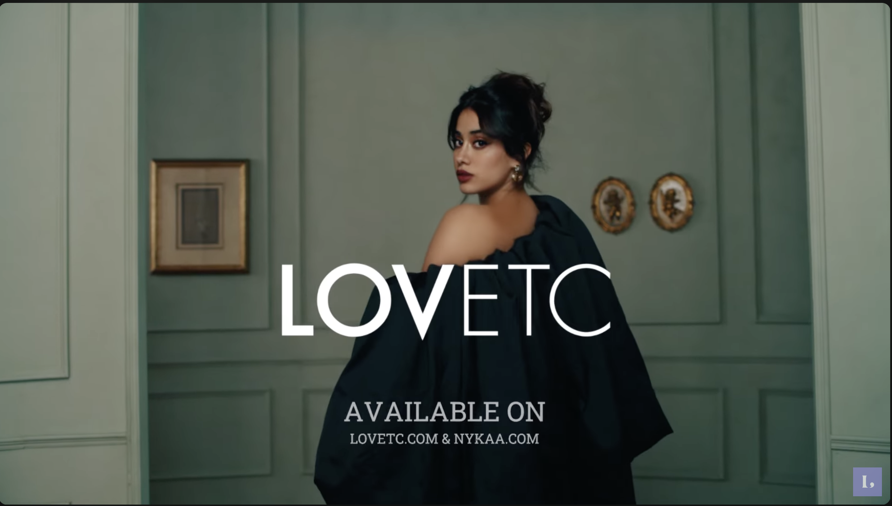</a>
			

			

				<h4>RCB x Qatar Airways</h4>
				
<i>Music Composition and Production 
				Composer - Sanjay Das</i>

				<a href="https://www.youtube.com/watch?v=NMLw3zU1UeQ">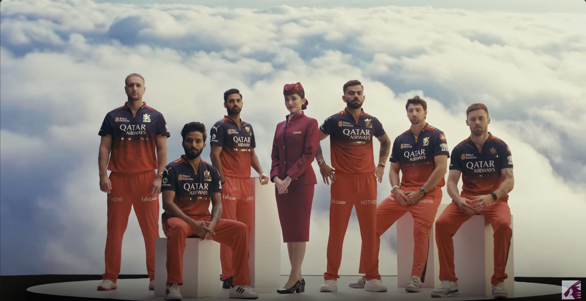</a>
			

			

				<h4>Gitam</h4>
				
<i>Music Composition and Production 
				Composer - Sanjay Das</i>

				
			

		

		

			

				<h4>Ather</h4>
				
<i>Music Composition and Production 
				Composer - Sanjay Das</i>

				<a href="https://vimeo.com/1050751835">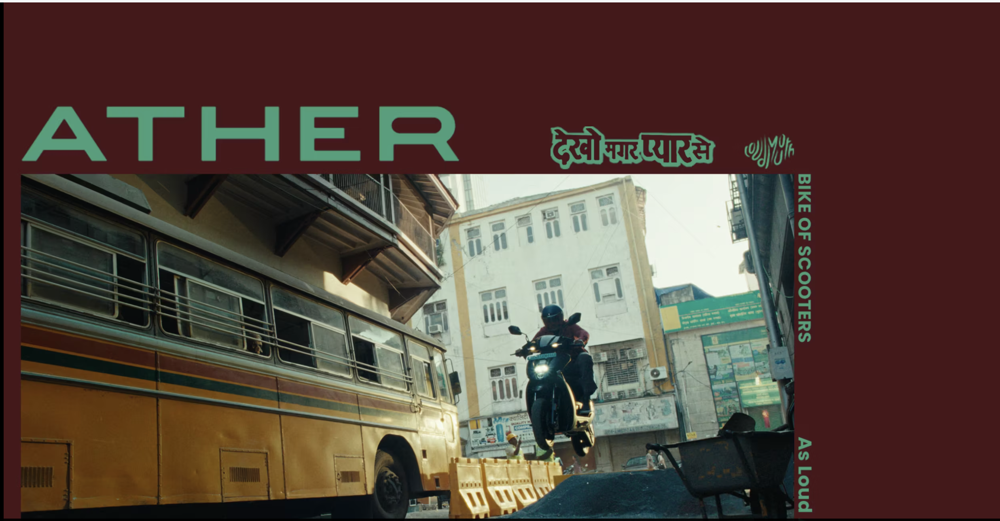</a>
			

			

				<h4>Inecto</h4>
				
<i>Music Composition and Production 
				Composer - Sanjay Das</i>

				<a href="https://vimeo.com/1031970418">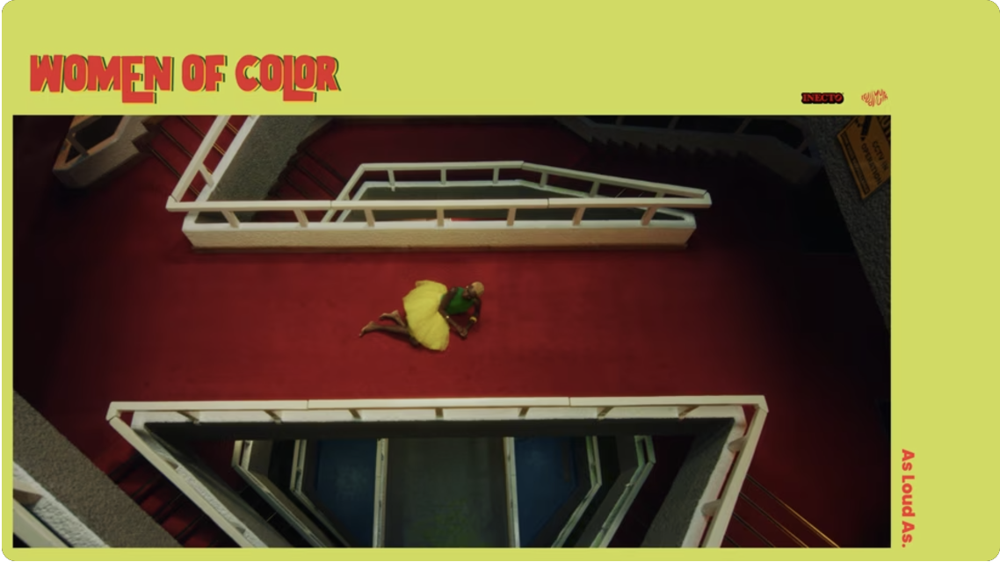</a>
			

			

				<h4>Durex</h4>
				
<i>Music Composition and Production 
				Composer - Sanjay Das</i>

				<a href="https://www.youtube.com/watch?v=GogDfOiOsnE">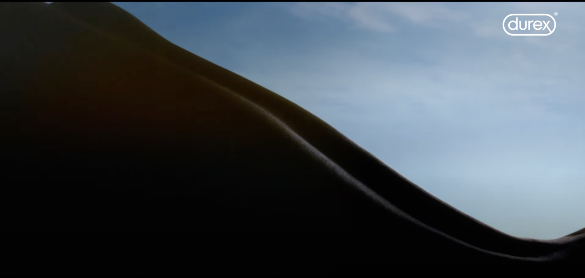</a>
			

		

			

			

			<h4>Sephora</h4>
			
<i>Music Composition and Production 
			Composer - Sanjay Das</i>

			
		

		

		<h4>Bata</h4>
		
<i>Music Composition and Production 
		Composer - Sanjay Das</i>

		<a href="https://www.youtube.com/watch?v=9MHBH3wEJZA">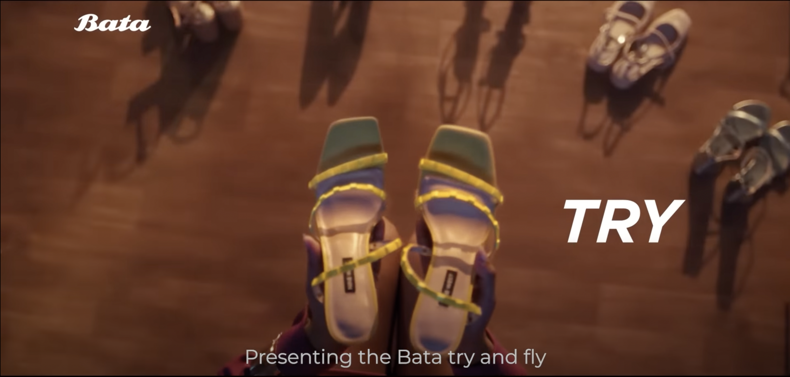</a>
		

		

		<h4>Lenskart</h4>
		
<i>Music Composition and Production 
		Composer - Sanjay Das</i>

		<a href="https://www.youtube.com/watch?v=olHGm-gUAZ8">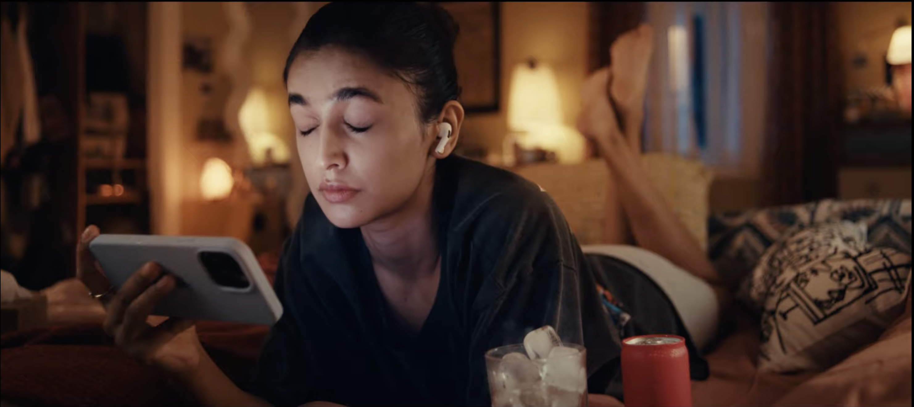</a>
		

		

		

		

		<h4>FitPass</h4>
		
<i>Music Composition and Production 
		Composer - Sanjay Das, Satyajit Chatterji</i>

		<a href="https://www.youtube.com/watch?v=4ebU6lNAJRs">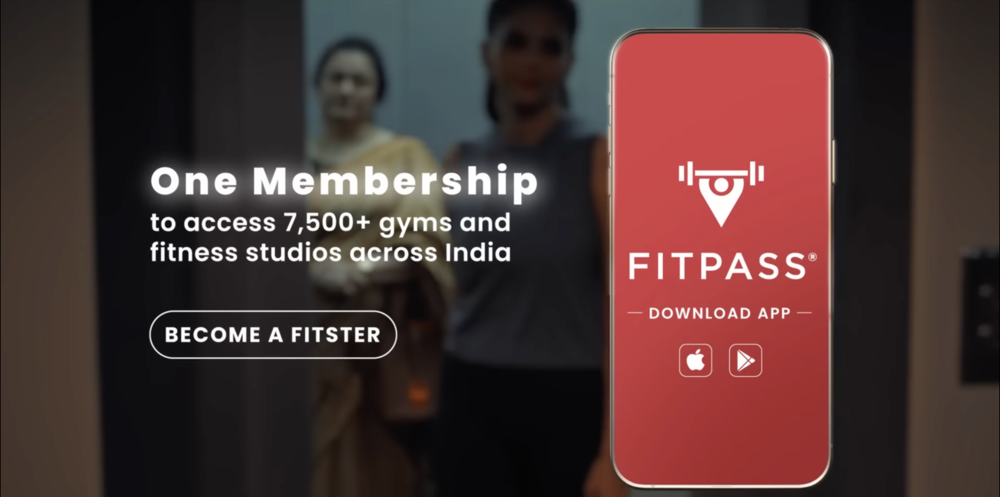</a>
		

		

		<h4>Boat AirDopes</h4>
		
<i>Music Composition and Production 
		Composer - Sanjay Das</i>

		<a href="https://www.instagram.com/p/C5IhV_QRU5L/">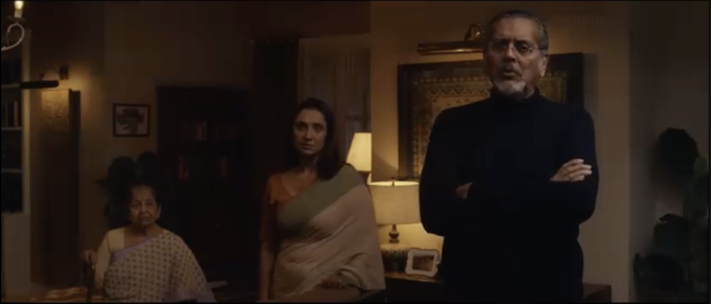</a>
		

		

		<h4>Prestige</h4>
		
<i>Music Composition and Production 
		Composer - Sanjay Das</i>

		<a href="https://www.instagram.com/p/C6DbIn7xvev/">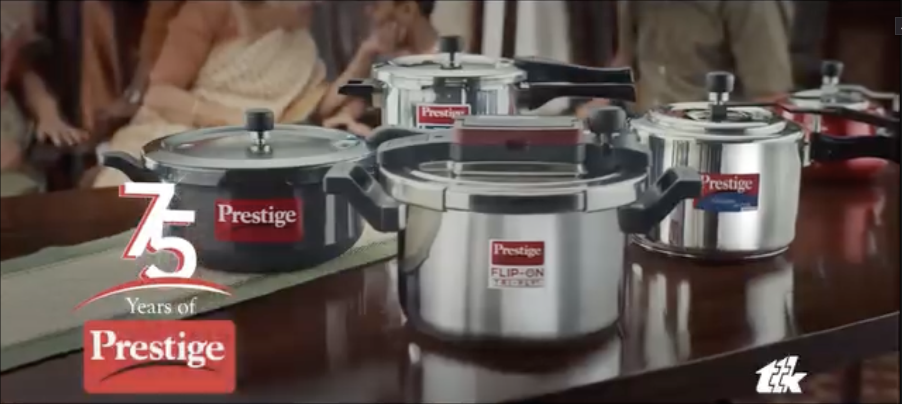</a>
		

		

		

		

		<h4>Goodbye, Hello</h4>
		
<i>Music Composition and Production 
		Composer - Sanjay Das, Satyajit Chatterji</i>

		<a href="https://www.imdb.com/title/tt27216865/?ref_=fn_al_tt_4">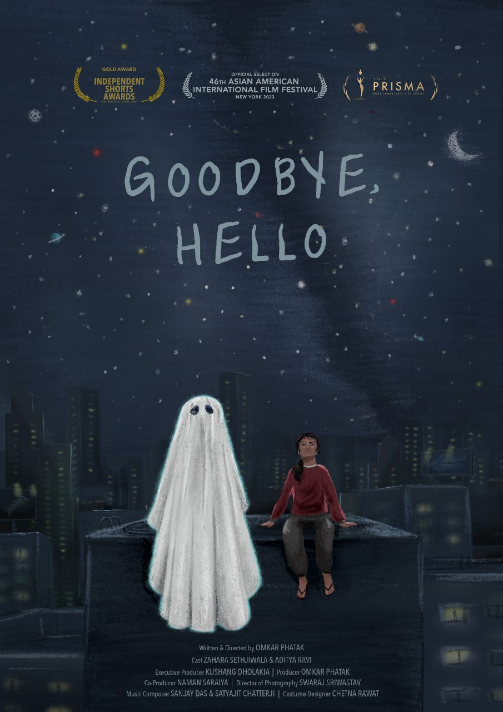</a>
		

		

		<h4>Vice x Amazon Prime Rainbow Rishta</h4>
		
<i>Music Composition and Supervision 
		Composer - Sanjay Das</i>

		
		

		

		<h4>In No Sence</h4>
		
<i>Music Composition and Production 
		Composer - Sanjay Das</i>

		<a href="https://homegrown.co.in/homegrown-creators/short-film-in-no-sence-infuses-catharsis-within-the-journey-of-trauma-memory">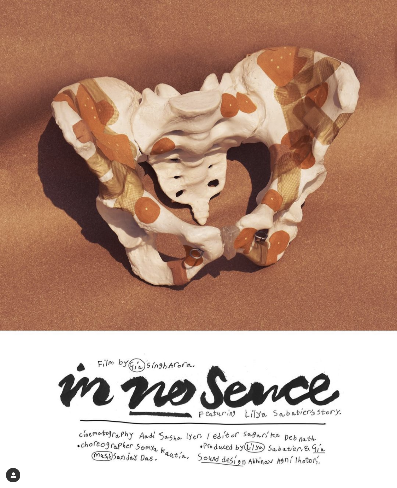</a>
		

		

		

		

		<h4>Vice x Audible DSOL</h4>
		
<i>Music Composition and Production 
		Composer - Sanjay Das</i>

		<a href="https://www.youtube.com/watch?v=g1sPRhNqBsA">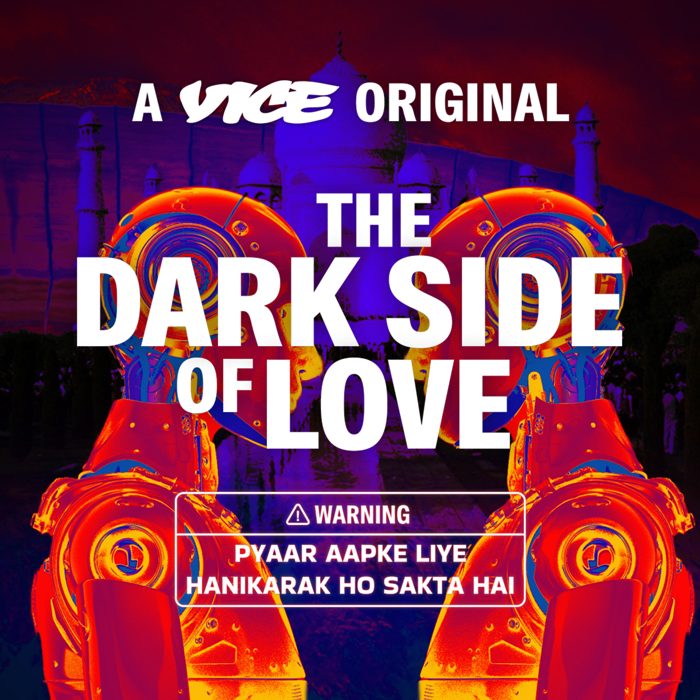</a>
		

		

		<h4>Toothpari</h4>
		
<i>Additional Composition 
		Composer - Neel Adhikari</i>

		<a href="https://www.imdb.com/title/tt27191658/">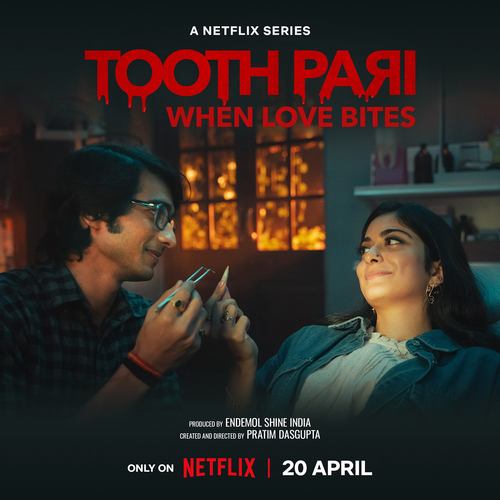</a>
		

		

		<h4>Vice x Audible DSOC (2022)</h4>
		
<i>Music Composition and Production 
		Composer - Sanjay Das</i>

		<a href="https://www.youtube.com/watch?v=dFbxhaC75J0">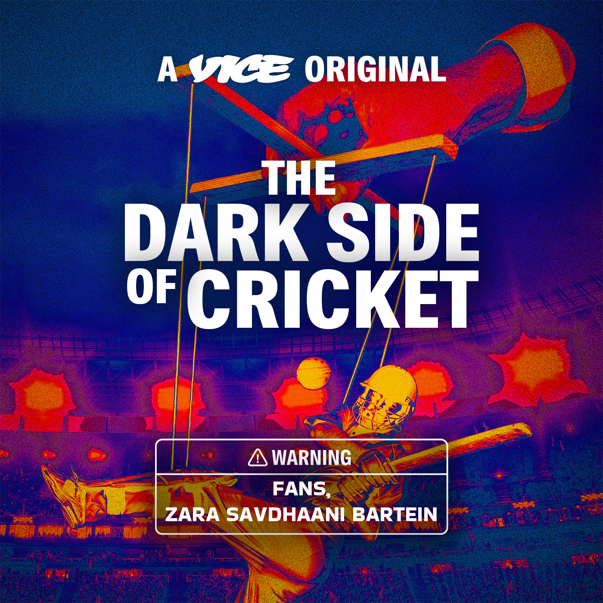</a>
		

		

		

		

		<h4>MUAF (2022)</h4>
		
<i>Music Composition and Production 
		Composer - Sanjay Das</i>

		<a href="https://www.instagram.com/p/Clxn0RJDTC0/">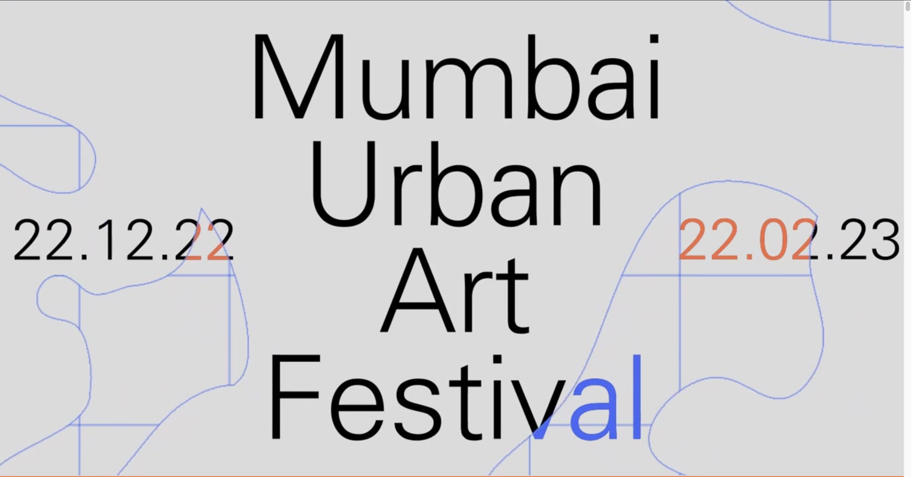</a>
		

		

		<h4>Google (2022)</h4>
		
<i>Music Composition and Production 
		Composer - Sanjay Das</i>

		<a href="https://www.youtube.com/watch?v=ZEsnmcyuZEU">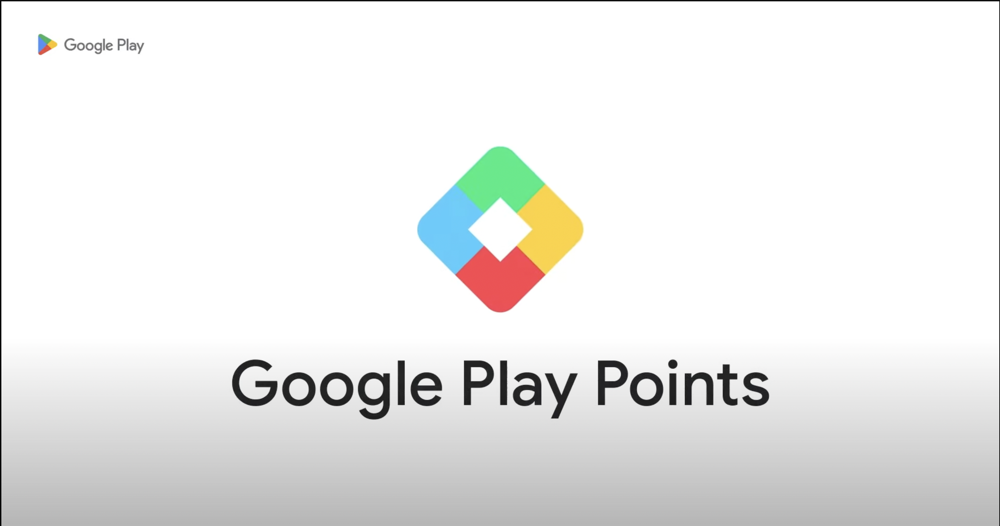</a>
		

		

		<h4>Instagram (2022)</h4>
		
<i>Music Composition and Production 
		Composer - Sanjay Das</i>

		<a href="">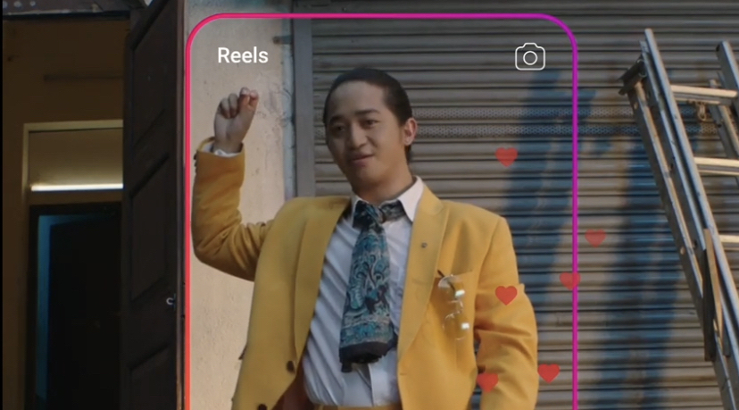</a>
		

		

		

		

		<h4>OnePlus (2022)</h4>
		
<i>Music Composition and Production 
		Composer - Sanjay Das</i>

		<a href="https://www.youtube.com/watch?v=8wTOGuFk3GQ">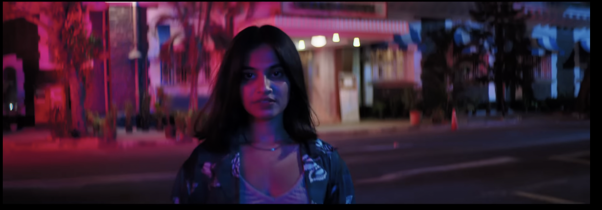</a>
		

		

		<h4>My Daughter Joined A Cult (2022)</h4>
		
<i>Music Composition and Production 
		Composer - Sanjay Das</i>

		<a href="https://www.youtube.com/watch?v=gIRwEJcnlzk">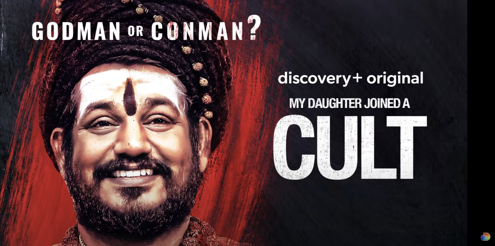</a>
		

		

		<h4>Ranveer vs Wild (2022)</h4>
		
<i>Additional Composition and Production 
		Composer - Neel Adhikari</i>

		
		

		

		

		

		<h4>Philips (2022)</h4>
		
<i>Music Composition and Production 
		Composer - Sanjay Das</i>

		<a href="https://www.youtube.com/watch?v=dktoLx6wdwo">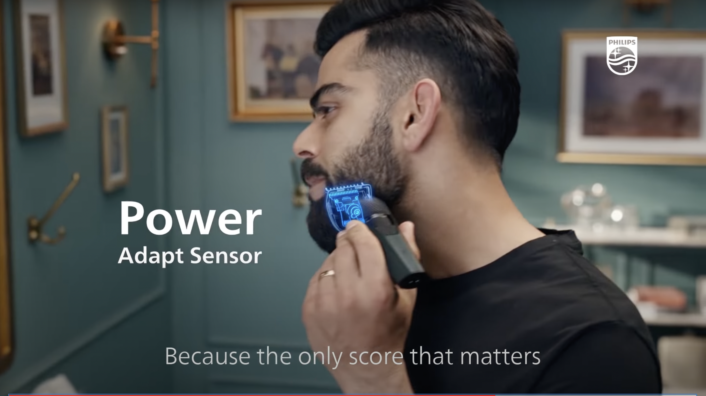</a>
		

		

		<h4>Treebo (2022)</h4>
		
<i>Music Composition and Production 
		Composer - Sanjay Das</i>

		<a href="https://www.youtube.com/watch?v=1opbg-srnDw">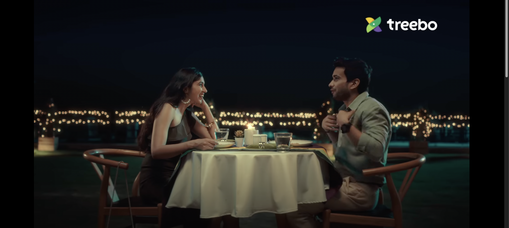</a>
		

		

		<h4>Battle Grounds Mobile India (2022)</h4>
		
<i>Music Composition and Production 
		Composer - Sanjay Das</i>

		<a href="https://www.youtube.com/watch?v=nSbni_y8md4">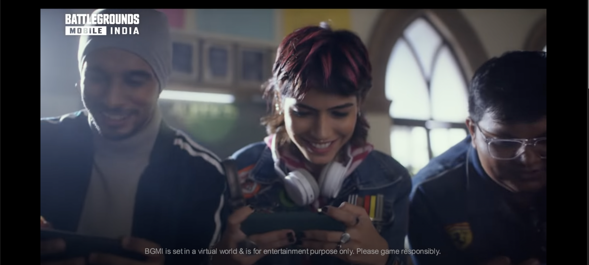</a>
		

		

		

	

		<h4>Battle Grounds Mobile India (2022)</h4>
		
<i>Music Composition and Production 
		Composer - Sanjay Das</i>

		<a href="https://youtu.be/pAFnKrubTmo">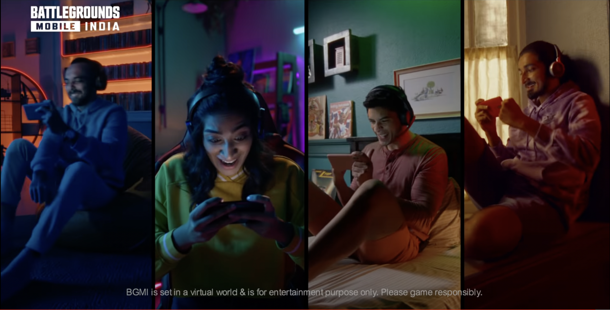</a>
	

		

		<h4>H&M (2021)</h4>
		
<i>Music Composition and Production 
		Composer - Sanjay Das</i>

		<a href="https://www.youtube.com/watch?v=lb2USXe6sSY">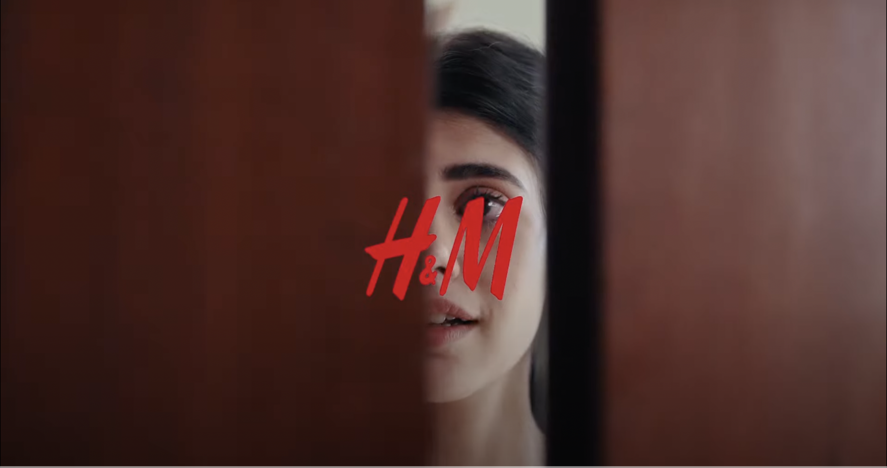</a>
	

		

		<h4>Johnnie Walker (2021)</h4>
		
<i>Music Composition and Production 
		Composer - Sanjay Das</i>

		<a href="https://www.instagram.com/tv/CXQyP9SoQEx/?utm_medium=copy_link">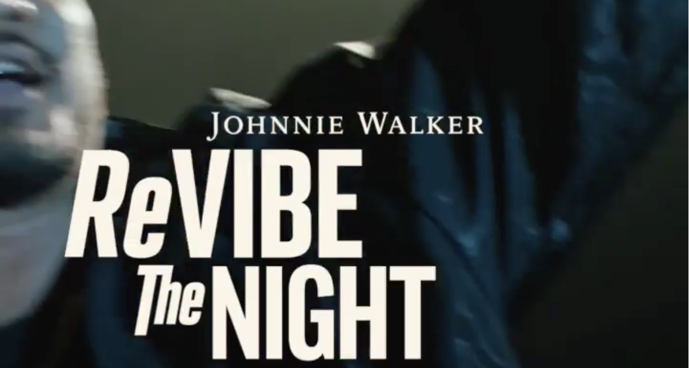</a>
	

	

		<h4>WhatsApp (2021)</h4>
		
<i>Music Composition and Production 
		Composer - Sanjay Das, Neel Adhikari</i>

		<a href="">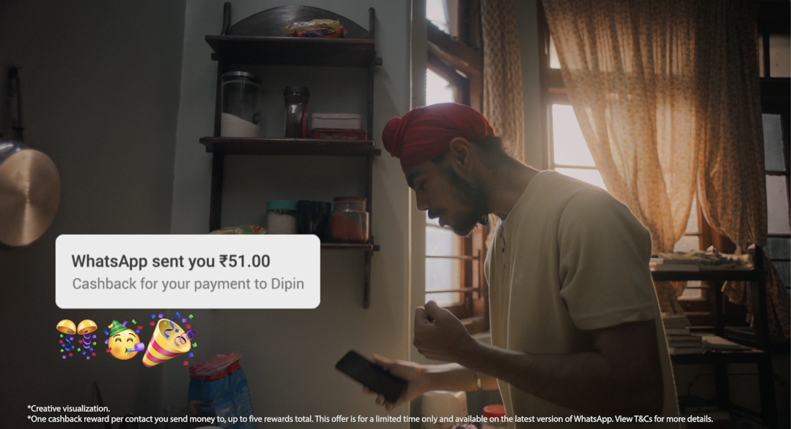</a>
	

		

		<h4>WOW (2021)</h4>
		
<i>Music Composition and Production 
		Composer - Sanjay Das</i>

		<a href="https://www.instagram.com/tv/CZisvoEJTdE/?utm_source=ig_web_copy_link">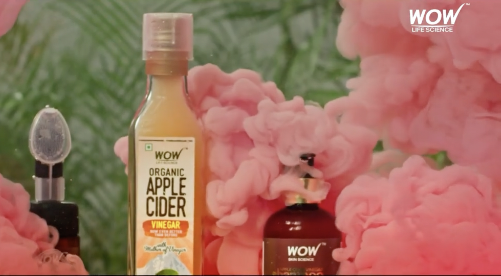</a>
	

	

		<h4>RCB (2020)</h4>
		
<i>Music Composition and Production 
		Composer - Sanjay Das, Neel Adhikari</i>

		
	

	

	

		<h4>Fossil (2020)</h4>
		
<i>Music Composition and Production 
		Composer - Sanjay Das, Satyajit Chatterji</i>

		
	

	

		<h4>Candy (2021)</h4>
		
<i>Music Production, Additional Composition  
		Composer - Neel Adhikari
		</i>

		<a href="https://www.imdb.com/title/tt9359294/?ref_=fn_al_tt_1">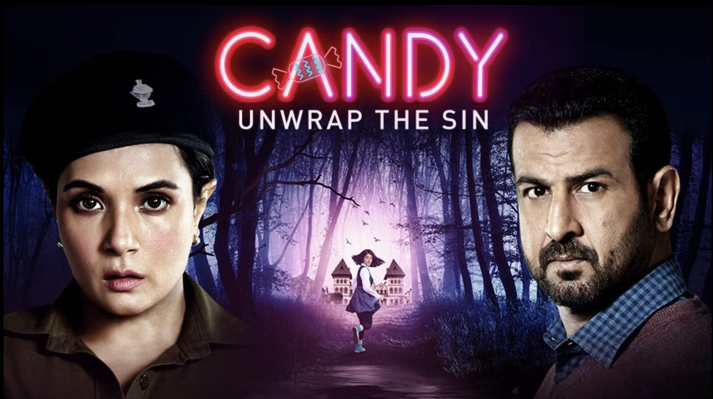</a>
	

	

		<h4>Hasmukh (2020)</h4>
		
<i>Music Production, Additional Composition  
		Composer - Neel Adhikari
		</i>

		
	

	

		<h4>Afsos (2020)</h4>
		
<i>Music Production, Additional Composition  
		Composer - Neel Adhikari
		</i>

		
	
 
	

		<h4>Little Things Season 3 (2019)</h4>
		
<i>Music Production, Additional Composition  
		Composer - Neel Adhikari
		</i>

		
	

	

		<h4>Thinkistan (2019)</h4>
		
<i>Music Production, Mixing</i>

		
Composer - Neel Adhikari

		
	

	

		<h4>Why Cheat India (2019)</h4>
		
<i>Music Production, Additional Composition  
		Composer - Neel Adhikari
		</i>

			
	

	

		<h4>Kia and Cosmos (2018)</h4>
		
<i>Music Production, Additional Composition  
		Composer - Neel Adhikari
		</i>

		
	

	

		<h4>Little Things Season 2 (2018)</h4>
		
<i>Music Production, Additional Composition  
		Composer - Neel Adhikari
		</i>

		
	

	

		<h4>0 K.M. (2018)</h4>
		
<i>Music Production, Additional Composition  
		Composer - Neel Adhikari
		</i>

		
	

	

		<h4>Garbage (2018)</h4>
		
<i>Diegetic Composition  
		Composer - Neel Adhikari
		</i>

		
	

	

		<h4>Bose: Dead/Alive (2017)</h4>
		
<i>Music Production 
		Composer - Neel Adhikari
		</i>

		
	

	

		<h4>Laakhon Mein Ek (2017)</h4>
		
<i>Music Production, Additional Composition  
		Composer - Neel Adhikari
		</i>

		
	

	

		<h4>What The Folks (2017)</h4>
		
<i>Music Production 
		Composer - Neel Adhikari
		</i>

		
	

	

		<h4>SBG (2016)</h4>
		
<i>Music Production 
		Composer - Neel Adhikari
		</i>

		
	

<!-- //---ENGINEERING--// -->

<section id="three">
	

		<header class="major">
			<h1>Soundpacks for Ampify Music (Novation)</h1>
			
High quality bespoke sample packs for Ampify Music, a subsidiary of Focusrite Group U.K. 

		</header>

	

	<h3>Mumbai Fusion</h3>
	
<i>Launchpad, Ampify Studio</i>

	<a href="https://ampifymusic.com/the-hub/ampify-sounds-philtersoup/">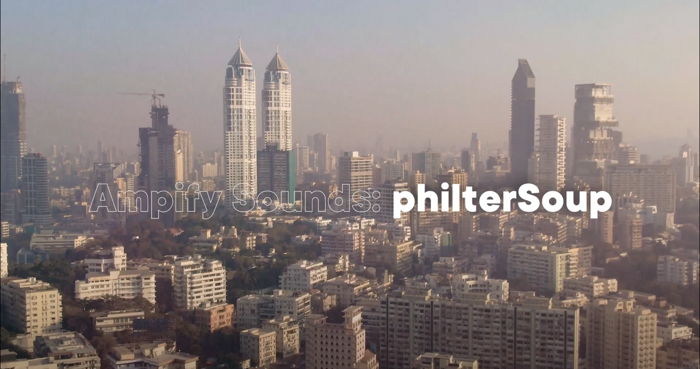</a>
	

	

		<h3>Modular EBM</h3>
		
<i>Launchpad, Ampify Studio</i>

		<a href="https://ampifymusic.com/the-hub/ampify-sounds-philtersoup/">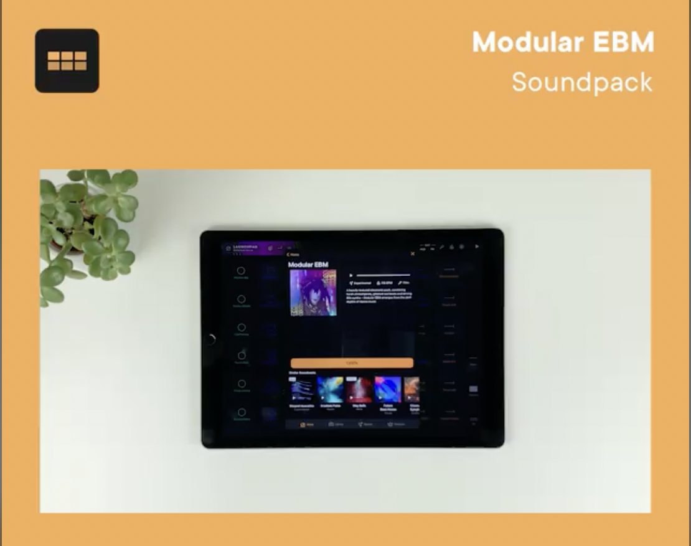</a>
	

	

		<h3>Glitch Capital</h3>
		
<i>Launchpad, Ampify Studio</i>

		
	

<!-- Content -->
<!-- <h2 id="content">Sample Content</h2> -->

<footer id="footer">
		

			<ul class="icons">
				
				<li><a href="{{ site.twitter_url }}" class="icon alt fa-twitter" target="_blank">Twitter</a></li>
				
				
				<li><a href="{{ site.googleplus_url }}" class="icon alt fa-google-plus" target="_blank">Google+</a></li>
				
				
				<li><a href="{{ site.facebook_url }}" class="icon alt fa-facebook" target="_blank">Facebook</a></li>
				
				
				<li><a href="{{ site.instagram_url }}" class="icon alt fa-instagram" target="_blank">Instagram</a></li>
				
				
				<li><a href="{{ site.pinterest_url }}" class="icon alt fa-pinterest" target="_blank">Pinterest</a></li>
				
				
				<li><a href="{{ site.gitlab_url }}" class="icon alt fa-gitlab" target="_blank">GitLab</a></li>
				
				
				<li><a href="{{ site.github_url }}" class="icon alt fa-github" target="_blank">GitHub</a></li>
				
				
				<li><a href="{{ site.slack_url }}" class="icon alt fa-slack" target="_blank">Slack</a></li>
				
				
				<li><a href="{{ site.linkedin_url }}" class="icon alt fa-linkedin" target="_blank">LinkedIn</a></li>
				
			</ul>
			<ul class="copyright">
				<li>&copy; {{ site.title }} {{ site.subtitle }}</li>

			</ul>
		

	</footer>

