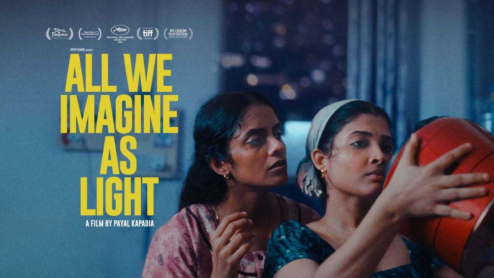
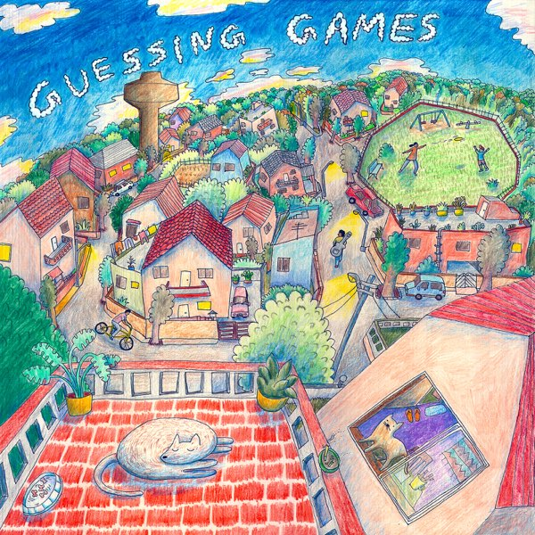

<!-- Main -->

<!-- One -->
<!-- //---ENGINEERING--// -->

<section id="one">
	

		<header class="major">
			<h1>Production & Engineering</h1>
		</header>

	

	<h3>All We Imagine As Light</h3>
	
<i>Mix Engineer</i>

	
	

	

		<h3>TV Dinner </h3>
		
<i>Mix Engineer</i>

		
	

	

		<h3>Skin </h3>
		
<i>Mix Engineer</i>

		
	

	

	<h3>Doktor Gandu: Republic of Gandu</h3>
	
<i>Producer, Mix Engineer</i>

	
	

	

		<h3>Park Street Local EP </h3>
		
<i>Producer, Mix Engineer</i>

		
	

	

		<h3>Ganesh Talkies: GIFS </h3>
		
<i>Recording Engineer</i>

		
	

	

		<h3>Run It's the Kid</h3>
		
<i>Recording Engineer</i>
 
		
	

	

		<h3>The Supersonics: Heads Up</h3>
		
<i>Recording Engineer</i>

		
	

	

		<h3>Ganesh Talkies: In Technicolor</h3>
		
<i>Recording Engineer</i>

		
	

<footer id="footer">
		

			<ul class="icons">
				
				<li><a href="{{ site.twitter_url }}" class="icon alt fa-twitter" target="_blank">Twitter</a></li>
				
				
				<li><a href="{{ site.googleplus_url }}" class="icon alt fa-google-plus" target="_blank">Google+</a></li>
				
				
				<li><a href="{{ site.facebook_url }}" class="icon alt fa-facebook" target="_blank">Facebook</a></li>
				
				
				<li><a href="{{ site.instagram_url }}" class="icon alt fa-instagram" target="_blank">Instagram</a></li>
				
				
				<li><a href="{{ site.pinterest_url }}" class="icon alt fa-pinterest" target="_blank">Pinterest</a></li>
				
				
				<li><a href="{{ site.gitlab_url }}" class="icon alt fa-gitlab" target="_blank">GitLab</a></li>
				
				
				<li><a href="{{ site.github_url }}" class="icon alt fa-github" target="_blank">GitHub</a></li>
				
				
				<li><a href="{{ site.slack_url }}" class="icon alt fa-slack" target="_blank">Slack</a></li>
				
				
				<li><a href="{{ site.linkedin_url }}" class="icon alt fa-linkedin" target="_blank">LinkedIn</a></li>
				
			</ul>
			<ul class="copyright">
				<li>&copy; {{ site.title }} {{ site.subtitle }}</li>

			</ul>
		

	</footer>

